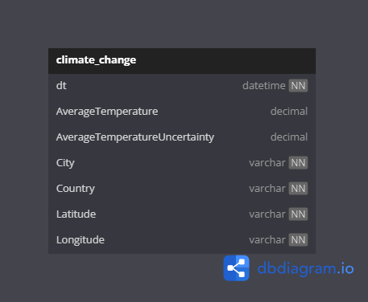

# icelake

Implementação de Delta Lake e Apache Iceberg para disciplina de Engenharia de Dados.

## modelo ER



## iniciando

Nesta seção você encontrará os passos para instalar e executar o projeto na sua máquina.

## pré-requisitos

* <a href="https://www.oracle.com/java/technologies/javase/jdk17-readme-downloads.html">JDK 17</a>
* <a href="https://www.python.org/downloads/">Python</a>

## instalação

1. Clone o repositório
   ```sh
   git clone https://github.com/guilherme-savio/icelake.git
   ```

2. Caso esteja utilizando Windows, certifique-se que ele esteja apto para [utilizar Linux como subsistema](https://code.visualstudio.com/docs/remote/wsl-tutorial)

3. Abra a pasta `icelake` e inicie a instalação das dependências
   ```sh
   python -m venv env
   .\env\Scripts\activate
   pip install -r requirements.txt
   ```

## integrantes

- [@guilherme-savio](https://github.com/guilherme-savio)
- [@higorgoulart](https://github.com/higorgoulart)
- [@Bruno-Venturini](https://github.com/Bruno-Venturini)
